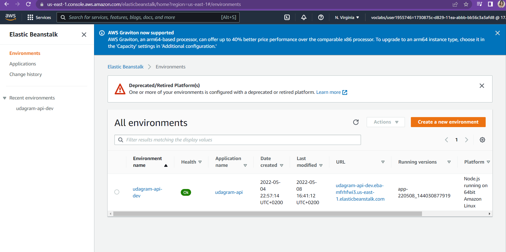
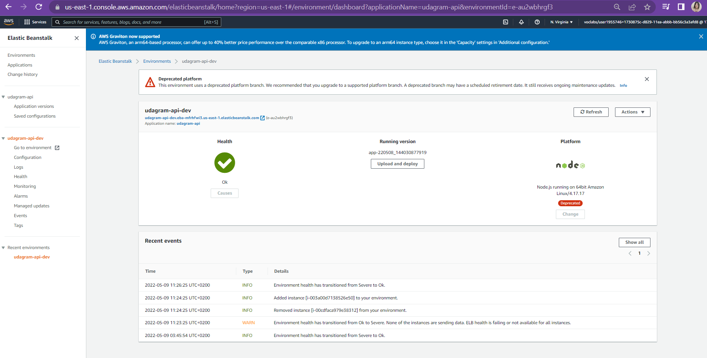
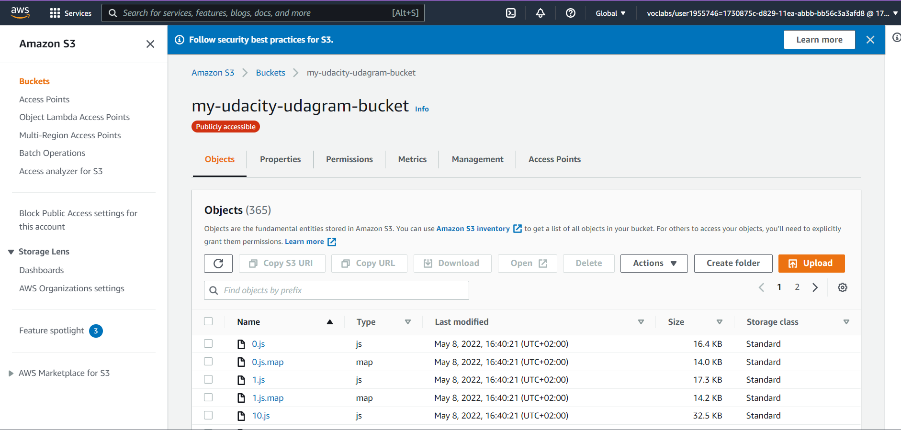
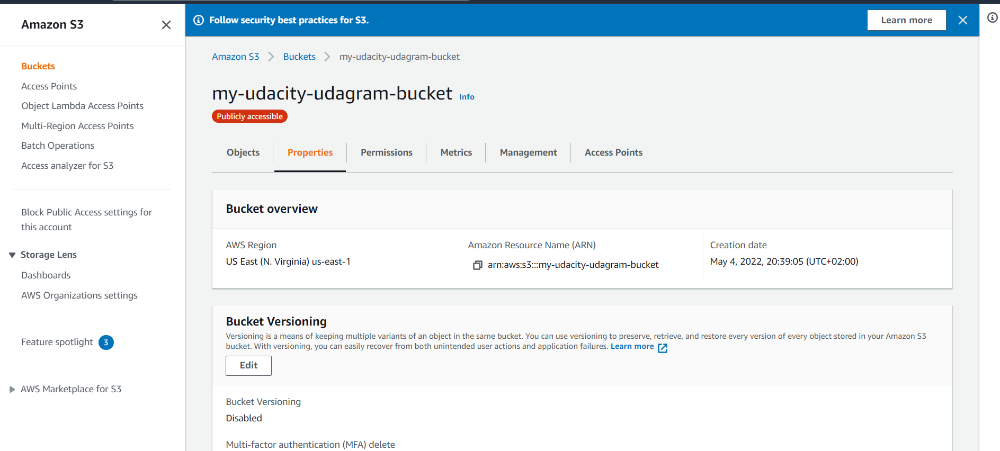
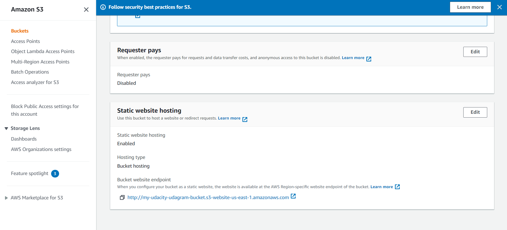
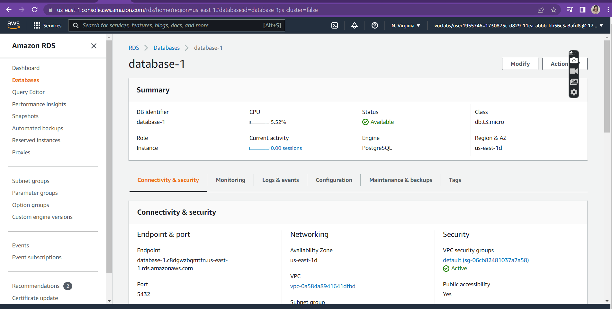
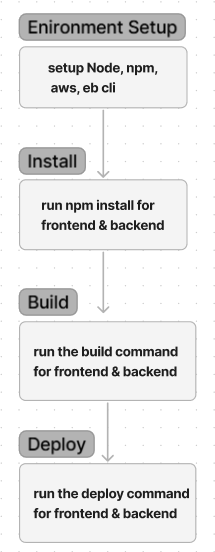

# Udagram

This project is part of the Udacity FullStack JavaScript nanodegree. 

## App Dependencies

The project was built with

- Node v14.16.1
- Angular v8.2.14
- AWS CLI 2.2.5
- EB CLI 3.19.4

##The app is accessible via this link
http://my-udacity-udagram-bucket.s3-website-us-east-1.amazonaws.com

See additional documentation in the documentation folder.

## Configuration Screenshots

### Elastic Beanstalk Environment

### FrontEnd S3 Bucket

### PostgreSQL RDS database

Schema

### Architecture

