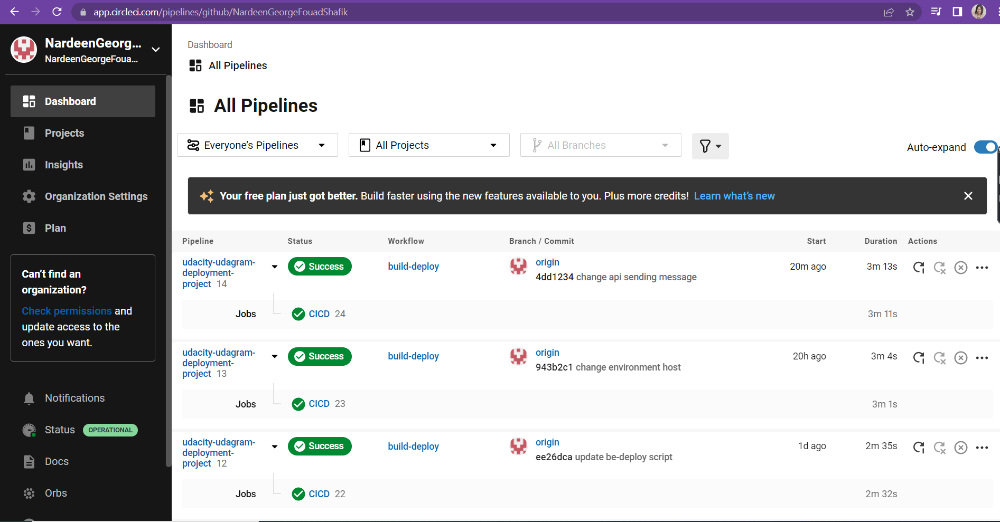
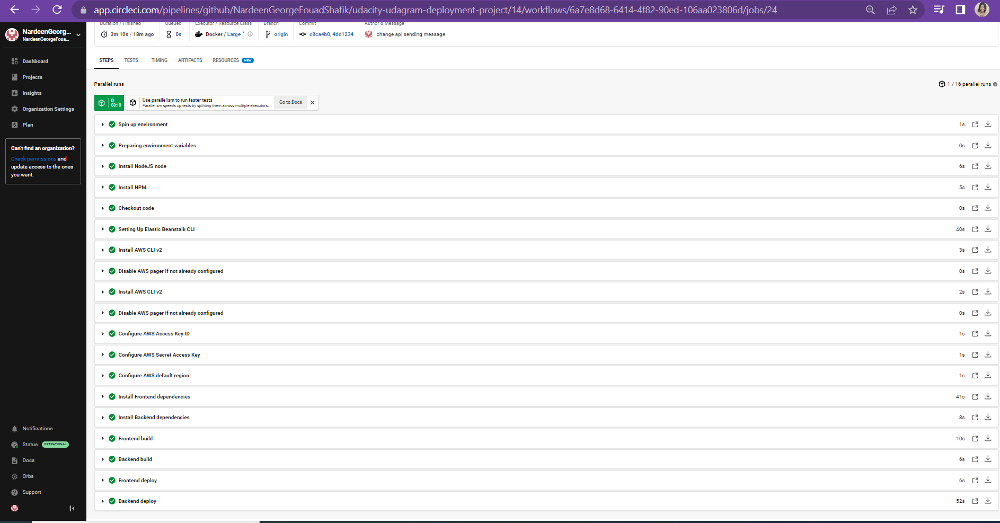
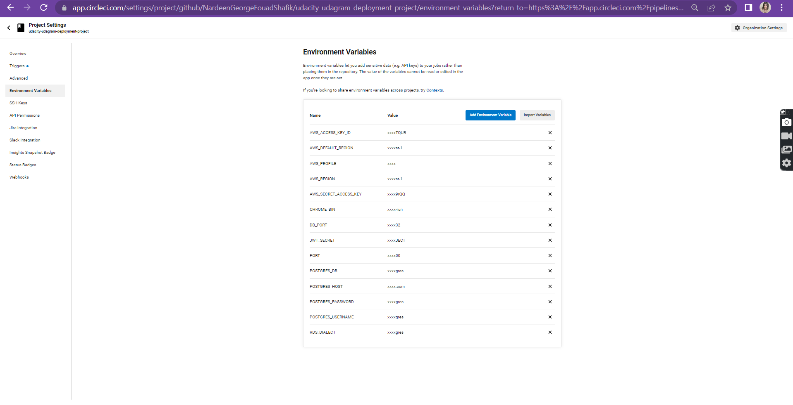

# Udagram

This project is part of the Udacity FullStack JavaScript nanodegree. 

## App Dependencies

The project was built with

- Node v14.16.1
- Angular v8.2.14
- AWS CLI 2.2.5
- EB CLI 3.19.4

## The app is accessible via this link
http://my-udacity-udagram-bucket.s3-website-us-east-1.amazonaws.com

See additional documentation in the documentation folder.

## Configuration Screenshots

### Elastic Beanstalk Environment

#### The api link
http://udagram-api-dev.eba-mfrhfwi3.us-east-1.elasticbeanstalk.com/

### FrontEnd S3 Bucket

### PostgreSQL RDS database

### CircleCI Pipeline

Schema

### Architecture

### Infrastructure Description
[Infrastructure Document](./documentation/Infrastructure.md)

### Infrastructure Description
[App Dependencies](./documentation/App%20Dependencies.md)

### Infrastructure Description
[Pipeline Process](./documentation/Pipeline%20Process.md)
