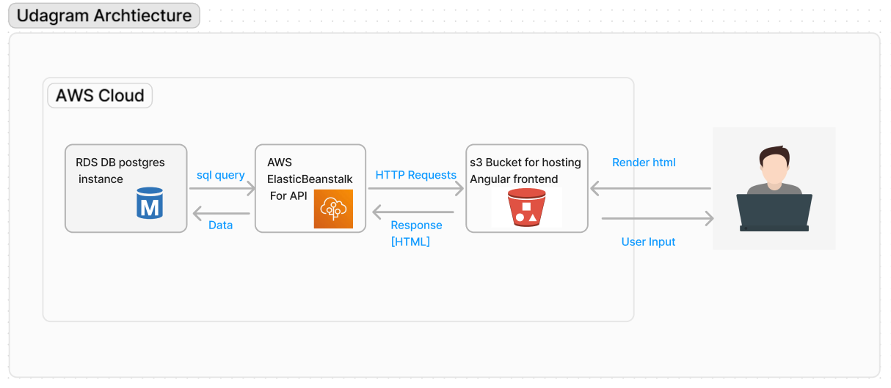

# Infrastructure

## AWS services in use

- **RDS**
  - provides a public accessible PostgresSQL database.
- **S3**
  - provides the frontend hosting and also the place where the backend saves uploaded images and files.
- 
- **Elastic Beanstalk**
  - provides the backend hosting

## Infrastracture Schema

